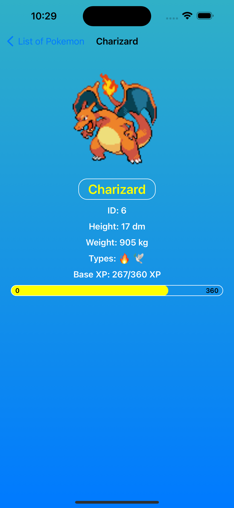
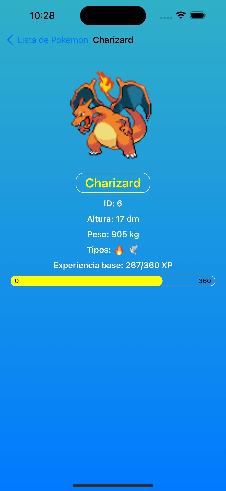

# PokemonListApp

This app lists all existing Pokemon using data from PokéAPI (https://pokeapi.co). Users can see names and thumbnails of Pokemon and tap on them to find out more details about each one.

## Features

- **List of Pokemon**: Paginated list names and thumbnails of Pokemon.

- **Details View**: Shows more information like abilities and stats after tapping a Pokemon name.

- **Localization**: UI element texts are localized to English and Spanish, according to device preferences.

- **Tests**: Project includes unit tests covering the majority of the code and mocking API calls.

## Stack
- MVVM-C
- UIKIT
- Networking
- API Mocking
- Infinite/Paginated scroll
- API error management/recovery
- Localization

## How to Run

To run this project on your local machine, follow these steps:

1. **Clone the Repository**: First, clone this repository to your local machine using Git.

2. **Open the Project**: Open the `Pokedex.xcodeproj` file in Xcode.

3. **Wait for SPM Dependencies**: Once the project is open in Xcode, wait for the Swift Package Manager (SPM) to fetch and build all the dependencies. This might take a few minutes.

4. **Run the Project on Simulator**: After all dependencies are resolved, select an iOS Simulator from the Xcode toolbar and click the run button to build and run the project on the simulator.

Enjoy exploring Pokemon in the app!
